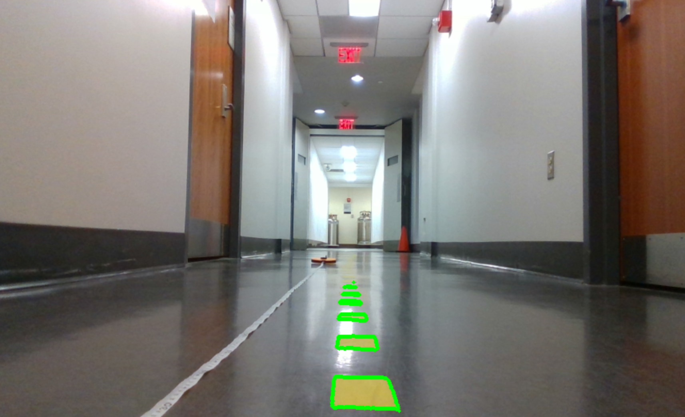
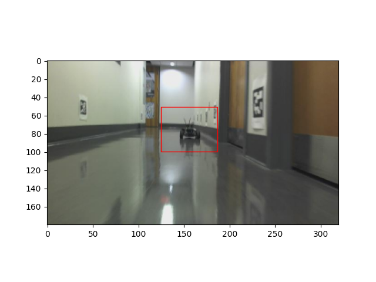
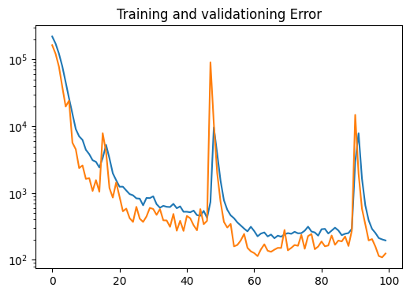

# Lab 8: Vision Lab

## The x, y distance of the unknown cones?
x = 0.6073170711938449(m), y = 0.1203107928975107(m)

## Lane Detection Result Image

## Integrated Object Detection + Distance Calculation Result Image
x = 2.371242966269783(m), y = 0.06029048322711096(m)

## Neural Network Training & Testing Loss Plot

## Is FP16 faster? Why?

FP16: 0.000237s

FP32: 0.001006s

FP16 is faster because it uses 16-bit floating point instead of 32-bit, which means it reduces the precision by half. Therefore, it needs much less memory and is a lot faster.

